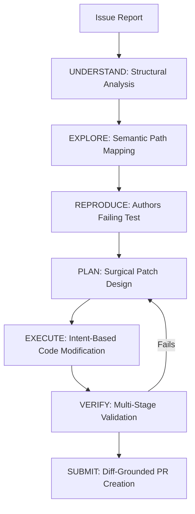

# Repatch | Autonomous Engineering Agent

[](https://opensource.org/licenses/MIT)
[](https://www.typescriptlang.org/)
[](https://www.docker.com/)

Repatch is an autonomous, test-driven engineering agent designed to handle the entire bug-fixing lifecycle with zero human intervention. Unlike standard LLM assistants, Repatch is grounded by an **Inviolable Loop** of empirical verification, ensuring that every patch is not just generated, but proven correct in a sandboxed environment.

---

##  Core Pillars

### 1. The Inviolable Loop (Empirical TDD)
Repatch operates on a strict state machine that mandates reproduction before implementation. 
- **Reproduction-First**: The agent is physically unable to modify source code until it has authored a test case that fails against the current HEAD.
- **Surgical Execution**: High-precision `edit_file` operations minimize diff noise.
- **Verification Guarantee**: Every submission includes raw logs of the reproduction failure and the subsequent verification success.

### 2. Semantic Path Grounding (Map of Truth)
To eliminate the "hallucinated paths" common in autonomous agents, Repatch builds a **Semantic Index** of the repository upon initialization. This "Map of Truth" ensures the agent's internal monologue is always grounded in the actual file system structure.

### 3. Factual Narratives (Zero-Hallucination PRs)
Repatch generates PR descriptions based exclusively on the **Actual Git Diff**, not the initial plan.
- **Diff-Grounding**: The agent analyzes the final code changes post-execution to write factual engineering narratives.
- **Plan Divergence Tracking**: If the implementation diverged from the plan (e.g., "Simplified approach to fix critical import error"), it is explicitly noted.

### 4. Deterministic Sandboxing
Leveraging **Nixpacks** and **Docker**, Repatch automatically detects the project's runtime (Node, Python, Go, etc.) and spawns an ephemeral, OCI-compliant container for isolated test execution and linting.

---

##  Technical Architecture



- **Orchestration**: Decoupled Step Pattern (Strategy Pattern) for robust state transitions.
- **Inference Layer**: Provider-agnostic wrapper supporting OpenAI, Anthropic, and Gemini.
- **Fuzzy Matching**: Custom sliding-window algorithm for surgical code edits that resist minor whitespace/indentation shifts.
- **Persistence Middleware**: Checkpoint-based state management for long-running autonomous tasks.

---

##  Getting Started

### Prerequisites
- **Node.js 20+**
- **Docker Desktop** (Daemon must be running)
- **GH_TOKEN** (Exported in your environment for PR submission)

### Installation
```bash
git clone https://github.com/Sagar-024/Repatch.git
cd Repatch
npm install
npm run build
```

### Usage
Run the agent against any public repository or local path:
```bash
# Example: Fix a logic error in a local repo
npm run dev -- autofix /path/to/repo -i "Calculator returns false for 1+1"
```

---

## 📄 License
This project is licensed under the MIT License - see the [LICENSE](LICENSE) file for details.
